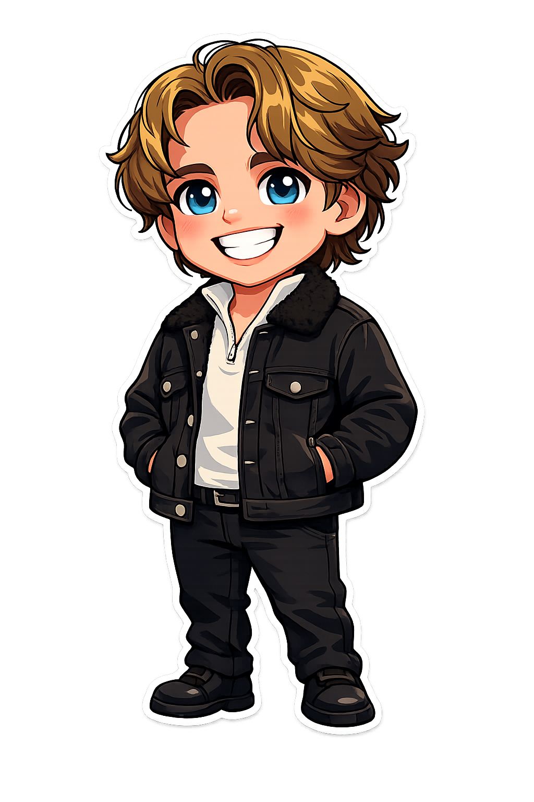
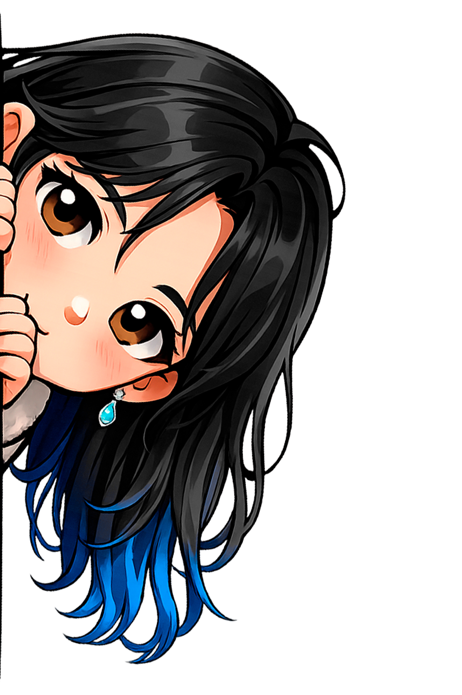

# Контекст проекта: ann-happy-birthday

## Структура файлов

```
ann-happy-birthday/
├── index.html
├── css/style.css
├── js/
│   ├── typewriter.js
│   ├── presentation.js
│   └── app.js
└── assets/images/
    ├── ann.png                 — основной персонаж Аня
    ├── ann-hiding-normal.png   — Аня выглядывает (нейтраль)
    ├── ann-hiding-up.png       — Аня смотрит вверх
    ├── ann-hiding-down.png     — Аня прячется
    └── antony.png              — персонаж Антон
```

---

## index.html

```html
<!doctype html>
<html lang="ru">
  <head>
    <meta charset="UTF-8" />
    <meta name="viewport" content="width=device-width, initial-scale=1.0, viewport-fit=cover" />
    <meta name="theme-color" content="#e8a0bf" />
    <title>Happy Birthday!</title>
    <link rel="preconnect" href="https://fonts.googleapis.com" />
    <link rel="preconnect" href="https://fonts.gstatic.com" crossorigin />
    <link href="https://fonts.googleapis.com/css2?family=Cormorant+Garamond:ital,wght@0,400;0,600;1,400&family=Montserrat:wght@400;500;600&display=swap" rel="stylesheet" />
    <link rel="stylesheet" href="css/style.css" />
  </head>
  <body>
    <div class="presentation" id="presentation">
      <section class="slide slide--active" data-slide="0">
        <div class="slide__content">
          <p class="slide__heading">Ух ты! Кажется у одного особенного человека сегодня особенный день!</p>
          <p class="slide__subtext">Жмякай «Дальше», у&nbsp;меня есть кое&#8209;что важное, что я&nbsp;бы хотел тебе рассказать</p>
          <button class="slide__btn" data-action="next">Дальше</button>
        </div>
      </section>

      <section class="slide" data-slide="1">
        <div class="slide__split">
          <div class="slide__split-text">
            <p class="slide__text" data-reveal="0">Небольшой инструктаж</p>
            <p class="slide__text" data-reveal="2000">В целом-то здесь ничего сложного, видишь кнопку "Дальше"? Нажимай на нее и смотри, что будет, а если нет, значит я от тебя что-то жду еще 😏</p>
            <p class="slide__text" data-reveal="4000">Не время жевать сопли, полетели!</p>
            <button class="slide__btn" data-action="next" data-reveal="6000">Дальше</button>
          </div>
          <div class="slide__split-image">
            
          </div>
        </div>
      </section>

      <section class="slide" data-slide="2">
        <div class="slide__content">
          <h2 class="slide__title">Слайд 3</h2>
          <p class="slide__text">Здесь будет контент</p>
          <button class="slide__btn" data-action="next">Дальше</button>
        </div>
      </section>
    </div>

    <div class="peeker" id="peeker" aria-hidden="true">
      
      
      
    </div>

    <div class="progress" id="progress">
      <div class="progress__bar" id="progressBar"></div>
    </div>

    <script src="js/typewriter.js"></script>
    <script src="js/presentation.js"></script>
    <script src="js/app.js"></script>
  </body>
</html>
```

---

## css/style.css

```css
:root {
  --color-bg: #fdf2f8;
  --color-bg-alt: #fce7f3;
  --color-primary: #e8a0bf;
  --color-primary-dark: #d4789a;
  --color-accent: #f472b6;
  --color-text: #4a2040;
  --color-text-light: #7c3a6b;
  --color-white: #ffffff;
  --font-display: "Cormorant Garamond", Georgia, serif;
  --font-body: "Montserrat", system-ui, sans-serif;
  --slide-transition: 0.6s cubic-bezier(0.4, 0, 0.2, 1);
  --vh-fallback: 100vh;
  --vh: 100dvh;
}
*, *::before, *::after { box-sizing: border-box; margin: 0; padding: 0; }
html { -webkit-text-size-adjust: 100%; text-size-adjust: 100%; }
body {
  min-height: var(--vh-fallback); min-height: var(--vh);
  font-family: var(--font-body);
  font-size: clamp(1rem, 0.9rem + 0.5vw, 1.125rem);
  line-height: 1.6; color: var(--color-text);
  background-color: var(--color-bg);
  overflow: hidden;
  -webkit-font-smoothing: antialiased;
}
img, picture, video, svg { display: block; max-width: 100%; }
button { font: inherit; cursor: pointer; border: none; background: none; color: inherit; touch-action: manipulation; -webkit-tap-highlight-color: transparent; }

.presentation { position: relative; width: 100%; height: var(--vh-fallback); height: var(--vh); overflow: hidden; }

.slide {
  position: absolute; inset: 0;
  display: flex; align-items: center; justify-content: center;
  padding: 1.5rem; opacity: 0; visibility: hidden;
  transform: translateX(30px);
  transition: opacity var(--slide-transition), transform var(--slide-transition), visibility 0s linear var(--slide-transition);
  will-change: opacity, transform;
}
.slide--active {
  opacity: 1; visibility: visible; transform: translateX(0);
  transition: opacity var(--slide-transition), transform var(--slide-transition), visibility 0s linear 0s;
}
.slide--exit {
  opacity: 0; visibility: hidden; transform: translateX(-30px);
  transition: opacity var(--slide-transition), transform var(--slide-transition), visibility 0s linear var(--slide-transition);
}

.slide__content { text-align: center; max-width: 40rem; width: 100%; padding: 2rem; }
.slide__title { font-family: var(--font-display); font-weight: 600; font-size: clamp(2rem, 1.5rem + 3vw, 4rem); line-height: 1.2; color: var(--color-text); margin-bottom: 1rem; }
.slide__text { font-size: clamp(1rem, 0.85rem + 0.75vw, 1.375rem); color: var(--color-text-light); margin-bottom: 2rem; line-height: 1.7; }
.slide__heading { font-family: var(--font-display); font-weight: 600; font-size: clamp(1.5rem, 1.2rem + 2vw, 2.75rem); line-height: 1.35; color: var(--color-text); margin-bottom: 1.25rem; }
.slide__subtext { font-size: clamp(0.95rem, 0.8rem + 0.6vw, 1.2rem); color: var(--color-text-light); margin-bottom: 2.5rem; line-height: 1.7; }

.slide__split { display: flex; flex-direction: column-reverse; align-items: center; gap: 1.5rem; max-width: 64rem; width: 100%; padding: 1.5rem; }
.slide__split-text { text-align: center; flex: 1; min-width: 0; }
.slide__split-image { flex-shrink: 0; display: flex; justify-content: center; }
.slide__character { width: clamp(8rem, 30vw, 16rem); height: auto; object-fit: contain; filter: drop-shadow(0 8px 24px rgba(74, 32, 64, 0.15)); }

[data-reveal] { opacity: 0; min-height: 1.2em; }
[data-reveal].revealed { opacity: 1; }
.typing::after { content: "▌"; display: inline; margin-left: 1px; animation: cursorBlink 0.6s step-end infinite; color: var(--color-primary); }
@keyframes cursorBlink { 0%, 100% { opacity: 1; } 50% { opacity: 0; } }

.slide__btn {
  display: inline-flex; align-items: center; justify-content: center;
  min-width: 10rem; min-height: 3rem; padding: 0.875rem 2.5rem;
  font-size: clamp(0.95rem, 0.85rem + 0.5vw, 1.125rem); font-weight: 500;
  color: var(--color-white);
  background: linear-gradient(135deg, var(--color-primary), var(--color-accent));
  border-radius: 3rem;
  transition: transform 0.2s ease, box-shadow 0.2s ease;
  user-select: none; -webkit-user-select: none;
}
.slide__btn:hover { transform: translateY(-2px); box-shadow: 0 6px 20px rgba(232, 160, 191, 0.4); }
.slide__btn:active { transform: translateY(0) scale(0.97); box-shadow: 0 2px 8px rgba(232, 160, 191, 0.3); }

/* Peeker */
.peeker {
  position: fixed; left: 0; top: 20%; z-index: 50;
  width: clamp(10rem, 24vw, 16rem); aspect-ratio: 3 / 4;
  transform: translateX(-100%) translateY(-50%);
  transition: transform 0.7s cubic-bezier(0.34, 1.56, 0.64, 1);
  pointer-events: none; user-select: none; -webkit-user-select: none;
}
.peeker--visible { transform: translateX(-6%) translateY(-50%); }
.peeker__img {
  position: absolute; top: 0; left: 0;
  width: 100%; height: 100%; object-fit: contain;
  opacity: 0;
  filter: drop-shadow(4px 0 20px rgba(74, 32, 64, 0.18));
}
.peeker__img--active { opacity: 1; }

/* Progress bar */
.progress { position: fixed; bottom: 0; left: 0; width: 100%; height: 4px; background: var(--color-bg-alt); z-index: 100; }
.progress__bar { height: 100%; background: linear-gradient(90deg, var(--color-primary), var(--color-accent)); transition: width 0.4s ease; width: 0%; }

@keyframes fadeInUp { from { opacity: 0; transform: translateY(20px); } to { opacity: 1; transform: translateY(0); } }
@keyframes pulse { 0%, 100% { transform: scale(1); } 50% { transform: scale(1.05); } }
.animate-fade-in-up { animation: fadeInUp 0.8s ease forwards; }
.animate-pulse { animation: pulse 2s ease-in-out infinite; }

@media (min-width: 768px) {
  .slide { padding: 3rem; }
  .slide__content { padding: 3rem; }
  .slide__split { flex-direction: row; gap: 3rem; padding: 2rem; }
  .slide__split-text { text-align: left; }
  .slide__character { width: clamp(12rem, 20vw, 20rem); }
  .progress { height: 5px; }
}
@media (min-width: 1024px) {
  .slide__content { max-width: 50rem; padding: 4rem; }
}
```

---

## js/typewriter.js

```js
class Typewriter {
  constructor() { this._gen = 0; }
  abort() { this._gen++; }
  run(slide) {
    const elements = Array.from(slide.querySelectorAll('[data-reveal]'));
    if (!elements.length) return;
    this._prepareElements(elements);
    const gen = this._gen;
    const aborted = () => gen !== this._gen;
    const INITIAL_DELAY = 400, GAP = 800, CHAR_MS = 35;
    const sequence = async () => {
      await this._wait(INITIAL_DELAY);
      if (aborted()) return;
      for (let i = 0; i < elements.length; i++) {
        const el = elements[i];
        if (this._isInteractive(el)) { el.textContent = el.dataset.originalText; el.classList.add('revealed'); }
        else { await this._typeElement(el, CHAR_MS, aborted); if (aborted()) return; }
        if (aborted()) return;
        if (i < elements.length - 1) { await this._wait(GAP); if (aborted()) return; }
      }
    };
    sequence();
  }
  _prepareElements(elements) {
    elements.forEach((el) => {
      if (!el.dataset.originalText && el.textContent.trim()) el.dataset.originalText = el.textContent;
      el.classList.remove('revealed', 'typing');
      el.textContent = '';
    });
  }
  async _typeElement(el, charMs, aborted) {
    const text = el.dataset.originalText || '';
    el.textContent = ''; el.classList.add('revealed', 'typing');
    for (let i = 0; i < text.length; i++) {
      if (aborted()) return;
      el.textContent += text[i];
      await this._wait(charMs);
    }
    if (!aborted()) el.classList.remove('typing');
  }
  _isInteractive(el) { return el.tagName === 'BUTTON' || el.tagName === 'A'; }
  _wait(ms) { return new Promise((resolve) => setTimeout(resolve, ms)); }
}
```

---

## js/presentation.js

```js
class Presentation {
  constructor(containerSelector) {
    this.container = document.querySelector(containerSelector);
    this.slides = Array.from(this.container.querySelectorAll('.slide'));
    this.currentIndex = 0; this.isAnimating = false;
    this.totalSlides = this.slides.length;
    this.progressBar = document.getElementById('progressBar');
    this.typewriter = new Typewriter();
    this._touchStartX = 0; this._touchStartY = 0; this._swipeThreshold = 50;
    this._bindEvents(); this._updateProgress();
  }
  _bindEvents() {
    this.container.addEventListener('click', (e) => {
      const btn = e.target.closest('[data-action]');
      if (!btn) return;
      if (btn.dataset.action === 'next') this.next();
      if (btn.dataset.action === 'prev') this.prev();
    });
    this.container.addEventListener('touchstart', (e) => {
      this._touchStartX = e.changedTouches[0].clientX;
      this._touchStartY = e.changedTouches[0].clientY;
    }, { passive: true });
    this.container.addEventListener('touchend', (e) => {
      const dx = e.changedTouches[0].clientX - this._touchStartX;
      const dy = e.changedTouches[0].clientY - this._touchStartY;
      if (Math.abs(dx) < this._swipeThreshold) return;
      if (Math.abs(dy) > Math.abs(dx)) return;
      if (dx < 0) this.next(); else this.prev();
    }, { passive: true });
    document.addEventListener('keydown', (e) => {
      if (e.key === 'ArrowRight' || e.key === ' ') { e.preventDefault(); this.next(); }
      if (e.key === 'ArrowLeft') { e.preventDefault(); this.prev(); }
    });
  }
  goTo(index) {
    if (this.isAnimating || index < 0 || index >= this.totalSlides || index === this.currentIndex) return;
    this.isAnimating = true; this.typewriter.abort();
    const currentSlide = this.slides[this.currentIndex];
    const nextSlide = this.slides[index];
    const direction = index > this.currentIndex ? 1 : -1;
    currentSlide.classList.remove('slide--active'); currentSlide.classList.add('slide--exit');
    nextSlide.style.transform = `translateX(${direction * 30}px)`;
    nextSlide.classList.add('slide--active');
    requestAnimationFrame(() => { nextSlide.style.transform = ''; });
    const onTransitionEnd = () => {
      currentSlide.classList.remove('slide--exit'); currentSlide.style.transform = '';
      this.isAnimating = false; currentSlide.removeEventListener('transitionend', onTransitionEnd);
    };
    currentSlide.addEventListener('transitionend', onTransitionEnd, { once: true });
    setTimeout(() => { if (this.isAnimating) onTransitionEnd(); }, 800);
    this.currentIndex = index; this._updateProgress(); this._onSlideChange(index);
  }
  next() { if (this.currentIndex < this.totalSlides - 1) this.goTo(this.currentIndex + 1); }
  prev() { if (this.currentIndex > 0) this.goTo(this.currentIndex - 1); }
  _updateProgress() {
    const progress = this.totalSlides > 1 ? (this.currentIndex / (this.totalSlides - 1)) * 100 : 100;
    this.progressBar.style.width = `${progress}%`;
  }
  _onSlideChange(index) {
    const slide = this.slides[index];
    slide.querySelectorAll('[data-animate]').forEach((el, i) => {
      el.style.animationDelay = `${i * 0.15 + 0.3}s`;
      el.classList.add(`animate-${el.dataset.animate}`);
    });
    this.typewriter.run(slide);
  }
}
```

---

## js/app.js

```js
document.addEventListener("DOMContentLoaded", () => {
  window.presentation = new Presentation("#presentation");
  runPeekerAnimation();
});

function runPeekerAnimation() {
  const peeker = document.getElementById("peeker");
  if (!peeker) return;
  const imgNormal = peeker.querySelector(".peeker__img--normal");
  const imgUp     = peeker.querySelector(".peeker__img--up");
  const imgDown   = peeker.querySelector(".peeker__img--down");

  function showImg(img) {
    [imgNormal, imgUp, imgDown].forEach((el) => el.classList.remove("peeker__img--active"));
    img.classList.add("peeker__img--active");
  }

  // Последовательность анимации — [задержка_мс, действие]
  const steps = [
    [1000, () => { peeker.classList.add("peeker--visible"); showImg(imgNormal); }],
    [ 800, () => showImg(imgDown)],
    [ 400, () => showImg(imgNormal)],
    [  20, () => showImg(imgUp)],
    [ 400, () => showImg(imgNormal)],
    [  20, () => showImg(imgDown)],
    [1000, () => peeker.classList.remove("peeker--visible")],
    [ 800, () => [imgNormal, imgUp, imgDown].forEach((el) => el.classList.remove("peeker__img--active"))],
  ];

  let delay = 0;
  steps.forEach(([ms, fn]) => { delay += ms; setTimeout(fn, delay); });
}
```

---

## Ключевые соглашения

- Новые слайды: `<section class="slide" data-slide="N">` внутри `#presentation`
- `data-reveal` на текстовых элементах — typewriter-эффект; порядок появления определяется позицией в DOM
- `data-animate="fade-in-up"` / `data-animate="pulse"` — CSS-анимации при входе на слайд
- `data-action="next"` / `data-action="prev"` — навигация через кнопки
- Peeker запускается один раз при загрузке; последовательность кадров — массив `steps` в `app.js`
- `assets/audio/` и `assets/fonts/` — пусты, зарезервированы
